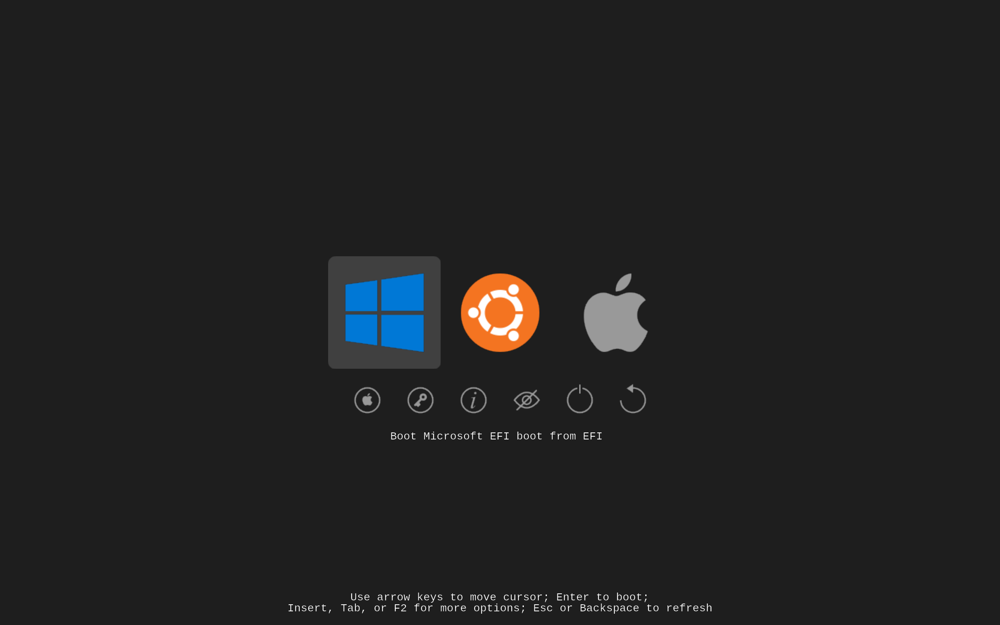

# Brad's Refind Theme

A clean, minimal theme for the rEFInd boot loader utility that
includes vector (.svg) artwork for all image resources.



See all [vector artwork here](https://raw.githubusercontent.com/toptensoftware/brads-refind-theme/main/icons/icons.svg). (Note the yellow backgrounds are 
guides and aren't included in exported pngs).

## Installation

1. Copy this entire folder to the B:\EFI\Refind\themes folder.

    eg: on Windows run adminstrator command prompt and then:

    ```
    > mountvol b: /s
    > b:
    > cd \EFI\Refind\themes
    > xcopy /s YOURCOPYOFTHEME brads-refind-theme
    ```

    OR:

    ```
    > mountvol b: /s
    > b:
    > cd \EFI\Refind\themes
    > git clone https://github.com/toptensoftware/brads-refind-theme.git
    ```
    

2. Edit your refind.conf:

    ```
    > cd \EFI\Refind
    > code refind.conf
    ```
    
    and at the bottom add:

    ```
    include themes/brads-refind-theme/theme.conf
    ```


## Re-exporting Images from Inkscape

If you make changes to any of the images in the .svg files you can easily
re-export the .svg to .png files as follows:

1. Install the [inkscape-export](https://www.npmjs.com/package/inkscape-export) 
   utility

2. From root directory of this project, run build.bat

For non-Windows platforms, the inkscape-export command should work but you'll
have to manually run the commands from build.bat.


## Credits

All OS logo artwork derived from Creative Commons licensed images.


## License

Copyright (C) 2021 Topten Software (contact@toptensoftware.com)
All rights reserved.

Licensed under the Apache License, Version 2.0 (the "License");
you may not use this product except in compliance with the License.
You may obtain a copy of the License at

<http://www.apache.org/licenses/LICENSE-2.0>

Unless required by applicable law or agreed to in writing, software
distributed under the License is distributed on an "AS IS" BASIS,
WITHOUT WARRANTIES OR CONDITIONS OF ANY KIND, either express or implied.
See the License for the specific language governing permissions and
limitations under the License.
